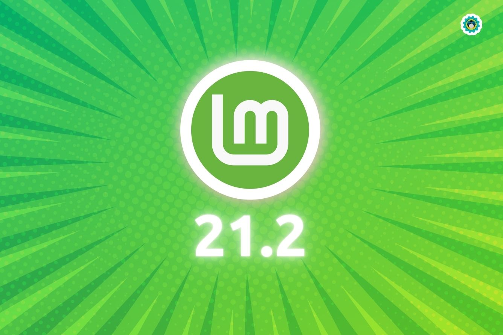

# Serpro-Linux Mint 21.2

NeoID é um certificado em nuvem disponibilizado através da [Serpro](https://www.loja.serpro.gov.br/neoid)

Este tutorial tem como objetivo auxiliar usuários que utilizam o Linux, a instalar o NeoID na distribuição Linux Mint 21.2. É provável que também funcione para as versões do Linux Mint 21, 21.1, porém, não foi testado.

    **NeoID**

                                     

                 

**Linux Mint**   

**Tutorial Realizado**  através do  **Departamento de TI**

[Prefeitura Muncipal de Prudentópolis - Paraná](https://www.prudentopolis.pr.gov.br/)

**Douglas Giovani Oechsler**

**Selmo Andrei Bobato**

